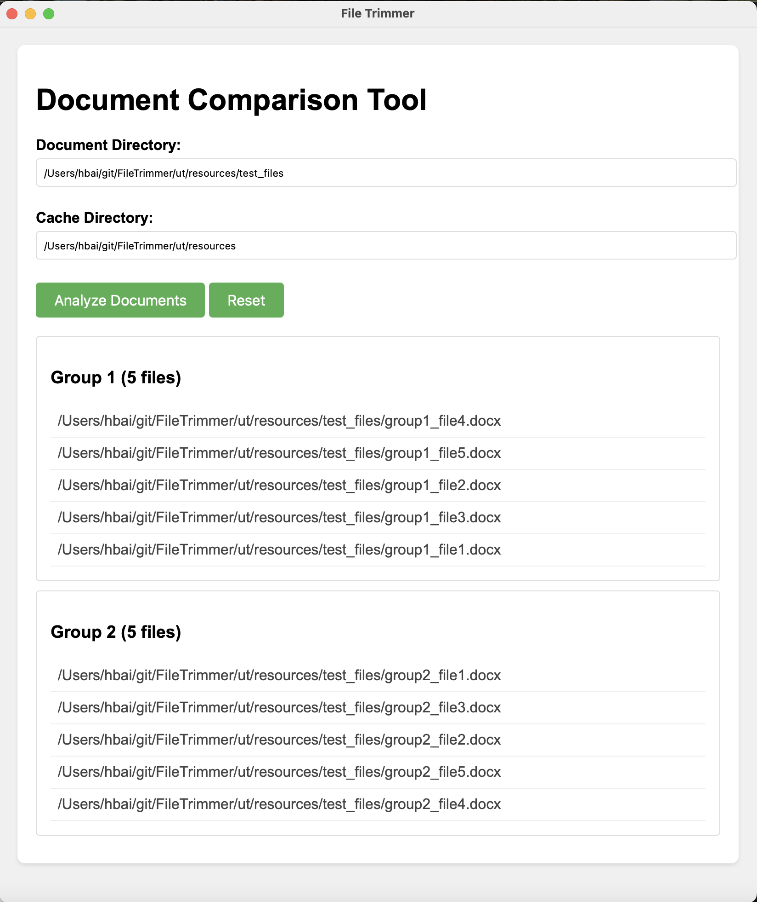

# FileTrimmer - Document Management Tool

A desktop application for analyzing and managing document files based on content similarity.



## Features
- 🖥️ Cross-platform GUI (Windows/macOS/Linux)
- 📂 Directory structure analysis
- 🔍 Content similarity comparison
- 🗄️ Cache management for faster subsequent runs
- 📊 Grouped results visualization

## Requirements
- Python 3.8+
- Modern web browser (embedded in application)

## Installation
```bash
# Clone repository
git clone https://github.com/your-username/FileTrimmer.git
cd FileTrimmer

# Install dependencies
pip install -r requirements.txt
